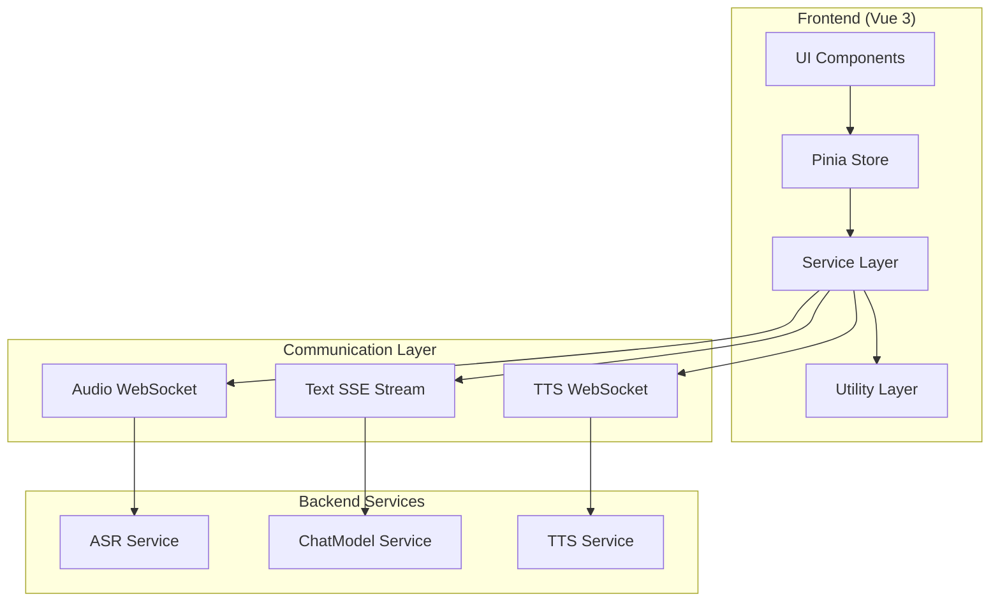

# Design Document

## Overview

本设计文档描述了基于Vue 3的实时语音对话前端应用的技术架构。系统采用组合式API（Composition API）和TypeScript构建，通过WebSocket和SSE实现与后端的多路数据通信。核心设计理念是模块化、响应式和高性能，确保音频数据的实时处理和流畅的用户体验。

## Architecture

### 整体架构图



### 技术栈选择

- **Vue 3** + **Composition API**: 提供响应式数据管理和组件复用
- **TypeScript**: 类型安全和更好的开发体验
- **Element Plus**: UI组件库，提供丰富的交互组件
- **Pinia**: 状态管理，替代Vuex
- **Vite**: 构建工具，快速开发和热更新
- **Web Audio API**: 音频采集、处理和播放
- **WebSocket API**: 实时双向通信
- **EventSource API**: SSE文本流接收

## Components and Interfaces

### 1. 核心组件结构

```
src/
├── components/
│   ├── VoiceChat.vue           # 主对话组件 (使用el-card, el-button等)
│   ├── AudioVisualizer.vue     # 音频可视化组件 (使用el-progress)
│   ├── StatusIndicator.vue     # 状态指示器组件 (使用el-tag, el-icon)
│   ├── ChatHistory.vue         # 对话历史组件 (使用el-timeline)
│   └── ControlPanel.vue        # 控制面板组件 (使用el-button-group)
├── composables/
│   ├── useAudioCapture.ts      # 音频采集逻辑
│   ├── useAudioPlayer.ts       # 音频播放逻辑
│   ├── useWebSocket.ts         # WebSocket连接管理
│   ├── useSSE.ts              # SSE连接管理
│   └── useVoiceChat.ts        # 语音对话主逻辑
├── services/
│   ├── AudioService.ts         # 音频处理服务
│   ├── ConnectionService.ts    # 连接管理服务
│   └── SessionService.ts       # 会话管理服务
├── stores/
│   ├── chatStore.ts           # 对话状态管理
│   └── connectionStore.ts     # 连接状态管理
├── types/
│   ├── audio.ts               # 音频相关类型定义
│   ├── chat.ts                # 对话相关类型定义
│   └── connection.ts          # 连接相关类型定义
└── utils/
    ├── audioUtils.ts          # 音频工具函数
    ├── formatUtils.ts         # 格式转换工具
    └── constants.ts           # 常量定义
```

### 2. 主要接口定义

```typescript
// types/audio.ts
interface AudioConfig {
  sampleRate: number;
  channels: number;
  bitDepth: number;
  frameSize: number;
}

interface AudioChunk {
  seq: number;
  timestamp: number;
  data: ArrayBuffer;
}

// types/chat.ts
interface ChatMessage {
  id: string;
  type: 'user' | 'assistant';
  content: string;
  timestamp: number;
  status: 'partial' | 'final';
}

interface TokenEvent {
  type: 'token' | 'done';
  text: string;
  seq: number;
}

// types/connection.ts
interface ConnectionState {
  audio: 'disconnected' | 'connecting' | 'connected' | 'error';
  text: 'disconnected' | 'connecting' | 'connected' | 'error';
  tts: 'disconnected' | 'connecting' | 'connected' | 'error';
}

interface SessionConfig {
  sessionId: string;
  audioWsUrl: string;
  textSseUrl: string;
  ttsWsUrl: string;
}
```

### 3. 核心Composables设计

#### useAudioCapture.ts
```typescript
export function useAudioCapture() {
  const isCapturing = ref(false);
  const audioContext = ref<AudioContext | null>(null);
  const mediaStream = ref<MediaStream | null>(null);
  
  const startCapture = async (onAudioData: (chunk: AudioChunk) => void) => {
    // 请求麦克风权限
    // 创建AudioContext和ScriptProcessor
    // 设置音频采集回调
  };
  
  const stopCapture = () => {
    // 停止音频采集
    // 清理资源
  };
  
  return {
    isCapturing: readonly(isCapturing),
    startCapture,
    stopCapture
  };
}
```

#### useAudioPlayer.ts
```typescript
export function useAudioPlayer() {
  const isPlaying = ref(false);
  const playQueue = ref<AudioChunk[]>([]);
  const currentSeq = ref(0);
  
  const addToQueue = (chunk: AudioChunk) => {
    // 按seq排序插入播放队列
  };
  
  const playFromQueue = () => {
    // 从队列取出音频块播放
    // 使用AudioBufferSourceNode
  };
  
  const stopPlayback = () => {
    // 停止播放并清空队列
  };
  
  return {
    isPlaying: readonly(isPlaying),
    currentSeq: readonly(currentSeq),
    addToQueue,
    stopPlayback
  };
}
```

#### useWebSocket.ts
```typescript
export function useWebSocket(url: string) {
  const ws = ref<WebSocket | null>(null);
  const connectionState = ref<'disconnected' | 'connecting' | 'connected' | 'error'>('disconnected');
  
  const connect = () => {
    // 建立WebSocket连接
    // 设置事件监听器
    // 实现自动重连
  };
  
  const send = (data: ArrayBuffer | string) => {
    // 发送数据，检查连接状态
  };
  
  const disconnect = () => {
    // 关闭连接
  };
  
  return {
    connectionState: readonly(connectionState),
    connect,
    send,
    disconnect,
    onMessage: (callback: (event: MessageEvent) => void) => void,
    onError: (callback: (error: Event) => void) => void
  };
}
```

## Data Models

### 1. 音频数据流模型

```typescript
// 音频配置常量
const AUDIO_CONFIG: AudioConfig = {
  sampleRate: 16000,
  channels: 1,
  bitDepth: 16,
  frameSize: 640 // 40ms at 16kHz
};

// 音频分片数据结构
class AudioChunkProcessor {
  private seq: number = 0;
  
  createChunk(pcmData: Int16Array): AudioChunk {
    return {
      seq: this.seq++,
      timestamp: Date.now(),
      data: pcmData.buffer
    };
  }
  
  convertFloat32ToInt16(float32: Float32Array): Int16Array {
    const int16 = new Int16Array(float32.length);
    for (let i = 0; i < float32.length; i++) {
      const s = Math.max(-1, Math.min(1, float32[i]));
      int16[i] = s < 0 ? s * 0x8000 : s * 0x7FFF;
    }
    return int16;
  }
  
  convertInt16ToFloat32(int16: Int16Array): Float32Array {
    const float32 = new Float32Array(int16.length);
    for (let i = 0; i < int16.length; i++) {
      float32[i] = int16[i] / 0x7FFF;
    }
    return float32;
  }
}
```

### 2. 对话状态模型

```typescript
// Pinia Store for Chat State
export const useChatStore = defineStore('chat', () => {
  const messages = ref<ChatMessage[]>([]);
  const currentMessage = ref<ChatMessage | null>(null);
  const chatState = ref<'idle' | 'listening' | 'thinking' | 'speaking'>('idle');
  
  const addMessage = (message: Omit<ChatMessage, 'id' | 'timestamp'>) => {
    const newMessage: ChatMessage = {
      ...message,
      id: generateId(),
      timestamp: Date.now()
    };
    messages.value.push(newMessage);
    return newMessage;
  };
  
  const updateCurrentMessage = (text: string, status: 'partial' | 'final') => {
    if (!currentMessage.value) {
      currentMessage.value = addMessage({
        type: 'assistant',
        content: text,
        status
      });
    } else {
      currentMessage.value.content = text;
      currentMessage.value.status = status;
    }
  };
  
  const finalizeCurrent = () => {
    if (currentMessage.value) {
      currentMessage.value.status = 'final';
      currentMessage.value = null;
    }
  };
  
  return {
    messages: readonly(messages),
    currentMessage: readonly(currentMessage),
    chatState: readonly(chatState),
    addMessage,
    updateCurrentMessage,
    finalizeCurrent,
    setChatState: (state: typeof chatState.value) => {
      chatState.value = state;
    }
  };
});
```

### 3. 连接管理模型

```typescript
// Pinia Store for Connection State
export const useConnectionStore = defineStore('connection', () => {
  const connections = ref<ConnectionState>({
    audio: 'disconnected',
    text: 'disconnected',
    tts: 'disconnected'
  });
  
  const sessionId = ref<string>('');
  const errors = ref<Record<string, string>>({});
  
  const updateConnectionState = (
    type: keyof ConnectionState, 
    state: ConnectionState[keyof ConnectionState]
  ) => {
    connections.value[type] = state;
  };
  
  const setError = (type: string, error: string) => {
    errors.value[type] = error;
  };
  
  const clearError = (type: string) => {
    delete errors.value[type];
  };
  
  const isAllConnected = computed(() => {
    return Object.values(connections.value).every(state => state === 'connected');
  });
  
  return {
    connections: readonly(connections),
    sessionId: readonly(sessionId),
    errors: readonly(errors),
    isAllConnected,
    updateConnectionState,
    setError,
    clearError,
    setSessionId: (id: string) => {
      sessionId.value = id;
    }
  };
});
```

## Error Handling

### 1. 错误分类和处理策略

```typescript
enum ErrorType {
  NETWORK_ERROR = 'network_error',
  PERMISSION_DENIED = 'permission_denied',
  AUDIO_CONTEXT_ERROR = 'audio_context_error',
  WEBSOCKET_ERROR = 'websocket_error',
  SSE_ERROR = 'sse_error',
  SESSION_TIMEOUT = 'session_timeout'
}

interface ErrorHandler {
  type: ErrorType;
  message: string;
  retry?: () => Promise<void>;
  fallback?: () => void;
}

class ErrorManager {
  private handlers = new Map<ErrorType, ErrorHandler>();
  
  registerHandler(type: ErrorType, handler: ErrorHandler) {
    this.handlers.set(type, handler);
  }
  
  async handleError(type: ErrorType, error: Error) {
    const handler = this.handlers.get(type);
    if (handler) {
      // 显示错误信息
      // 执行重试或回退策略
      if (handler.retry) {
        await handler.retry();
      } else if (handler.fallback) {
        handler.fallback();
      }
    }
  }
}
```

### 2. 网络重连机制

```typescript
class ReconnectionManager {
  private maxRetries = 5;
  private retryDelay = 1000;
  private retryCount = 0;
  
  async reconnect(connectFn: () => Promise<void>): Promise<boolean> {
    while (this.retryCount < this.maxRetries) {
      try {
        await connectFn();
        this.retryCount = 0;
        return true;
      } catch (error) {
        this.retryCount++;
        await this.delay(this.retryDelay * Math.pow(2, this.retryCount));
      }
    }
    return false;
  }
  
  private delay(ms: number): Promise<void> {
    return new Promise(resolve => setTimeout(resolve, ms));
  }
}
```

## Testing Strategy

### 1. 单元测试

```typescript
// 测试音频处理工具函数
describe('AudioUtils', () => {
  test('should convert Float32 to Int16 correctly', () => {
    const float32 = new Float32Array([0.5, -0.5, 1.0, -1.0]);
    const int16 = convertFloat32ToInt16(float32);
    expect(int16[0]).toBe(16383);
    expect(int16[1]).toBe(-16384);
  });
});

// 测试WebSocket连接管理
describe('useWebSocket', () => {
  test('should handle connection state changes', async () => {
    const { connectionState, connect } = useWebSocket('ws://test');
    expect(connectionState.value).toBe('disconnected');
    
    await connect();
    expect(connectionState.value).toBe('connected');
  });
});
```

### 2. 集成测试

```typescript
// 测试完整的语音对话流程
describe('Voice Chat Integration', () => {
  test('should complete full voice chat cycle', async () => {
    const { startChat, sendAudio, receiveText, receiveAudio } = useVoiceChat();
    
    // 开始对话
    await startChat();
    
    // 发送音频
    const audioData = new ArrayBuffer(1280);
    await sendAudio(audioData);
    
    // 接收文本
    const textEvent = await receiveText();
    expect(textEvent.type).toBe('token');
    
    // 接收音频
    const audioChunk = await receiveAudio();
    expect(audioChunk.data).toBeInstanceOf(ArrayBuffer);
  });
});
```

### 3. 性能测试

```typescript
// 测试音频处理性能
describe('Audio Performance', () => {
  test('should process audio chunks within time limit', () => {
    const processor = new AudioChunkProcessor();
    const largeAudioData = new Float32Array(16000); // 1秒音频
    
    const startTime = performance.now();
    const chunks = processor.processLargeAudio(largeAudioData);
    const endTime = performance.now();
    
    expect(endTime - startTime).toBeLessThan(100); // 100ms内完成
    expect(chunks.length).toBe(25); // 40ms分片，1秒25个
  });
});
```

### 4. 用户体验测试

- **延迟测试**: 从语音输入到文本显示的端到端延迟
- **音频质量测试**: 不同网络条件下的音频播放质量
- **并发测试**: 多个会话同时进行的性能表现
- **兼容性测试**: 不同浏览器和设备的兼容性
- **可访问性测试**: 键盘导航和屏幕阅读器支持

### 5. Element Plus UI设计

```typescript
// UI组件设计规范
interface UIComponents {
  // 主要按钮使用el-button
  primaryButton: 'el-button type="primary"';
  dangerButton: 'el-button type="danger"';
  
  // 状态显示使用el-tag
  statusTag: 'el-tag effect="dark"';
  
  // 进度显示使用el-progress
  audioProgress: 'el-progress type="line"';
  
  // 消息显示使用el-timeline
  chatTimeline: 'el-timeline';
  
  // 布局使用el-card和el-row/el-col
  mainLayout: 'el-card shadow="hover"';
  
  // 图标使用Element Plus图标
  microphoneIcon: 'Microphone';
  stopIcon: 'VideoPause';
}

// 主题配置
const themeConfig = {
  primaryColor: '#409EFF',
  successColor: '#67C23A',
  warningColor: '#E6A23C',
  dangerColor: '#F56C6C',
  infoColor: '#909399'
};
```

### 6. Mock服务

```typescript
// 模拟后端服务用于测试
class MockBackendService {
  simulateASR(audioData: ArrayBuffer): Promise<string> {
    return new Promise(resolve => {
      setTimeout(() => {
        resolve('模拟识别结果');
      }, 100);
    });
  }
  
  simulateChat(text: string): AsyncGenerator<string> {
    return async function* () {
      const tokens = text.split('');
      for (const token of tokens) {
        yield token;
        await new Promise(resolve => setTimeout(resolve, 50));
      }
    }();
  }
  
  simulateTTS(text: string): Promise<ArrayBuffer> {
    return new Promise(resolve => {
      const audioData = new ArrayBuffer(1280);
      setTimeout(() => resolve(audioData), 200);
    });
  }
}
```

这个设计文档提供了完整的技术架构，包括组件设计、数据模型、错误处理和测试策略。设计重点关注模块化、可测试性和性能优化，确保能够支持实时语音对话的复杂需求。Element Plus将提供统一的UI风格和丰富的交互组件。