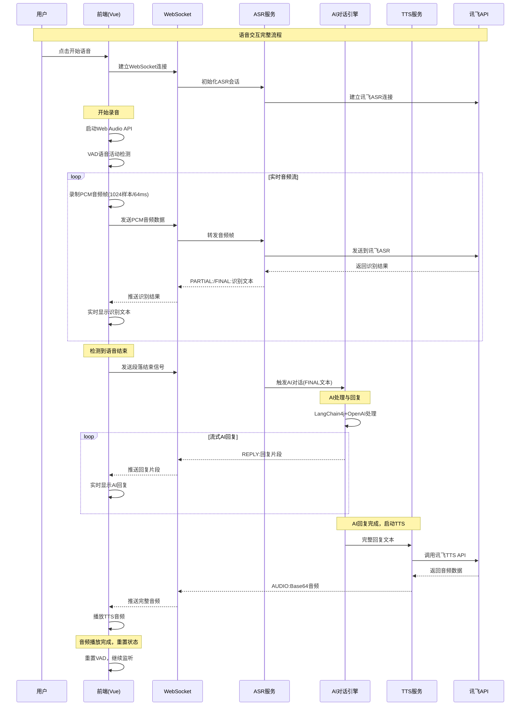

# AI Character Play 架构设计文档

## 项目概述

AI Character Play 是一个基于 Spring Boot + Vue 3 的智能对话应用，支持多角色AI对话、语音交互、实时聊天等功能。项目采用前后端分离架构，集成了多种AI服务和语音技术。

## 技术架构图

```
┌─────────────────────────────────────────────────────────────────┐
│                        前端层 (Vue 3)                            │
├─────────────────────────────────────────────────────────────────┤
│  用户界面  │  语音交互  │  状态管理  │  路由管理  │  API调用      │
│  (UI/UX)  │  (ASR/TTS) │  (Pinia)   │  (Router)  │  (Axios)     │
└─────────────────────────────────────────────────────────────────┘
                                │
                                ▼
┌─────────────────────────────────────────────────────────────────┐
│                        API网关层                                 │
├─────────────────────────────────────────────────────────────────┤
│           Spring Boot Web + WebSocket + CORS配置                │
└─────────────────────────────────────────────────────────────────┘
                                │
                                ▼
┌─────────────────────────────────────────────────────────────────┐
│                        业务逻辑层                                │
├─────────────────────────────────────────────────────────────────┤
│  用户管理  │  应用管理  │  对话引擎  │  语音处理  │  历史记录      │
│  Service   │  Service   │  Service   │  Service   │  Service     │
└─────────────────────────────────────────────────────────────────┘
                                │
                                ▼
┌─────────────────────────────────────────────────────────────────┐
│                        数据访问层                                │
├─────────────────────────────────────────────────────────────────┤
│              MyBatis Plus + MySQL + Redis                      │
└─────────────────────────────────────────────────────────────────┘
                                │
                                ▼
┌─────────────────────────────────────────────────────────────────┐
│                        外部服务层                                │
├─────────────────────────────────────────────────────────────────┤
│  					OpenAI API  │  讯飞语音				            │
│   				(NLP对话)   │  (ASR/TTS) 				          │
└─────────────────────────────────────────────────────────────────┘
```

## 语音交互核心流程架构

### 语音交互完整流程图



### 技术实现细节

#### 前端音频处理 
- **Web Audio API**: 实时音频录制和播放
- **VAD算法**: 智能语音活动检测，自动断句
- **音频格式**: PCM 16kHz 单声道，1024样本/帧
- **实时显示**: 流式ASR结果和AI回复显示
- **状态管理**: 录音状态、连接状态、播放状态

#### WebSocket通信协议
- **音频数据**: 二进制PCM数据流
- **ASR结果**: `PARTIAL:`部分结果, `FINAL:`最终结果
- **AI回复**: `REPLY:`流式回复片段
- **TTS音频**: `AUDIO:`Base64编码音频数据
- **控制信号**: JSON格式控制消息

#### 后端语音处理
- **ASR服务**: 讯飞实时语音识别集成
- **TTS服务**: 讯飞语音合成集成
- **音频存储**: 可选的音频文件存储

## 模块架构设计

### 1. 前端架构 (Vue 3 + TypeScript)

#### 1.1 目录结构
```
aichat-vue/
├── src/
│   ├── components/          # 通用组件
│   │   ├── VoiceChatBox.vue # 语音聊天组件
│   │   ├── ChatMessage.vue  # 消息组件
│   │   └── AppCard.vue      # 应用卡片组件
│   ├── pages/               # 页面组件
│   │   ├── User/            # 用户相关页面
│   │   ├── App/             # 应用管理页面
│   │   ├── Chat/            # 聊天页面
│   │   └── TestLogin.vue    # 登录测试页面
│   ├── layouts/             # 布局组件
│   │   └── BasicLayout.vue  # 基础布局
│   ├── stores/              # 状态管理
│   │   ├── user.ts          # 用户状态
│   │   ├── app.ts           # 应用状态
│   │   └── chat.ts          # 聊天状态
│   ├── services/            # API服务
│   │   ├── api.ts           # API配置
│   │   ├── userService.ts   # 用户服务
│   │   ├── appService.ts    # 应用服务
│   │   └── chatService.ts   # 聊天服务
│   ├── router/              # 路由配置
│   │   ├── index.ts         # 路由定义
│   │   └── guard.ts         # 路由守卫
│   └── types/               # 类型定义
│       ├── user.ts          # 用户类型
│       ├── app.ts           # 应用类型
│       └── chat.ts          # 聊天类型
```

#### 1.2 核心模块

**语音交互模块 (ASR/TTS)**
- **负责人**: 张子涵
- **功能**: 语音识别、语音合成、音频处理
- **技术栈**: Web Audio API + 讯飞语音SDK
- **核心文件**: 
  - `VoiceChatBox.vue` - 语音聊天界面
  - `voiceService.ts` - 语音服务封装

**用户界面模块**

- **负责人**: 张子涵
- **功能**: 响应式UI设计、用户交互、组件封装
- **技术栈**: Vue 3 + Element Plus + TypeScript
- **核心文件**:
  - 各页面组件和通用组件
  - CSS样式和主题配置

**状态管理模块**
- **功能**: 全局状态管理、数据持久化
- **技术栈**: Pinia + localStorage
- **核心文件**: `stores/` 目录下的状态管理文件

### 2. 后端架构 (Spring Boot)

#### 2.1 目录结构
```
src/main/java/com/character/
├── controller/              # 控制器层
│   ├── UserController.java  # 用户管理
│   ├── AppController.java   # 应用管理
│   ├── ChatController.java  # 聊天功能
│   └── VoiceController.java # 语音处理
├── service/                 # 业务逻辑层
│   ├── impl/
│   │   ├── UserServiceImpl.java    # 用户服务实现
│   │   ├── AppServiceImpl.java     # 应用服务实现
│   │   ├── ChatServiceImpl.java    # 聊天服务实现
│   │   └── VoiceServiceImpl.java   # 语音服务实现
│   └── interfaces/          # 服务接口
├── model/                   # 数据模型
│   ├── entity/              # 实体类
│   │   ├── User.java        # 用户实体
│   │   ├── App.java         # 应用实体
│   │   └── ChatHistory.java # 聊天记录实体
│   ├── dto/                 # 数据传输对象
│   └── vo/                  # 视图对象
├── mapper/                  # 数据访问层
│   ├── UserMapper.java      # 用户数据访问
│   ├── AppMapper.java       # 应用数据访问
│   └── ChatHistoryMapper.java # 聊天记录数据访问
├── config/                  # 配置类
│   ├── WebConfig.java       # Web配置
│   ├── RedisConfig.java     # Redis配置
│   └── LangChainConfig.java # AI配置
└── utils/                   # 工具类
    ├── JwtUtils.java        # JWT工具
    └── VoiceUtils.java      # 语音处理工具
```

#### 2.2 核心模块

**语音处理模块 (ASR/TTS)**
- **负责人**: 张子涵
- **功能**: 语音识别接口、语音合成接口、音频格式转换
- **技术栈**: 讯飞语音SDK + Spring Boot
- **核心文件**:
  - `VoiceController.java` - 语音接口控制器
  - `VoiceServiceImpl.java` - 语音服务实现
  - `VoiceUtils.java` - 语音处理工具类

**用户管理模块**
- **功能**: 用户注册、登录、权限管理、Session管理
- **技术栈**: Spring Security + Redis Session
- **核心文件**:
  - `UserController.java` - 用户接口
  - `UserServiceImpl.java` - 用户业务逻辑

**应用管理模块**
- **功能**: AI应用创建、配置、管理
- **核心文件**:
  - `AppController.java` - 应用接口
  - `AppServiceImpl.java` - 应用业务逻辑

**NLP对话模块**
- **功能**: AI对话生成、上下文管理、角色扮演
- **技术栈**: LangChain4j + OpenAI API
- **核心文件**:
  - `ChatController.java` - 对话接口
  - `ChatServiceImpl.java` - 对话业务逻辑

**对话历史模块**
- **功能**: 聊天记录存储、检索、管理
- **技术栈**: MyBatis Plus + MySQL
- **核心文件**:
  - `ChatHistoryMapper.java` - 历史记录数据访问
  - 相关Service实现

**数据库设计模块**
- **功能**: 数据库表设计、索引优化、数据迁移
- **技术栈**: MySQL 8.0 + MyBatis Plus
- **核心文件**:
  - 实体类定义
  - Mapper接口和XML配置

### 3. 数据库设计

#### 3.1 核心表结构

**用户表 (user)**
```sql
CREATE TABLE `user` (
  `id` bigint NOT NULL AUTO_INCREMENT COMMENT 'id',
  `user_account` varchar(256) NOT NULL COMMENT '账号',
  `user_password` varchar(512) NOT NULL COMMENT '密码',
  `user_name` varchar(256) DEFAULT NULL COMMENT '用户昵称',
  `user_avatar` varchar(1024) DEFAULT NULL COMMENT '用户头像',
  `user_profile` varchar(512) DEFAULT NULL COMMENT '用户简介',
  `user_role` varchar(256) NOT NULL DEFAULT 'user' COMMENT '用户角色',
  `create_time` datetime NOT NULL DEFAULT CURRENT_TIMESTAMP,
  `update_time` datetime NOT NULL DEFAULT CURRENT_TIMESTAMP ON UPDATE CURRENT_TIMESTAMP,
  `is_delete` tinyint NOT NULL DEFAULT '0',
  PRIMARY KEY (`id`),
  UNIQUE KEY `uk_userAccount` (`user_account`)
);
```

**应用表 (app)**
```sql
CREATE TABLE `app` (
  `app_id` bigint NOT NULL AUTO_INCREMENT COMMENT '应用ID',
  `app_name` varchar(255) DEFAULT NULL COMMENT '应用名',
  `description` varchar(255) DEFAULT NULL COMMENT '应用介绍',
  `init_prompt` varchar(1000) DEFAULT NULL COMMENT '初始化提示',
  `cover` varchar(255) DEFAULT NULL COMMENT '封面图片URL',
  `user_id` bigint NOT NULL COMMENT '所属用户ID',
  `prologue` varchar(1000) DEFAULT NULL COMMENT '开场白',
  `priority` int DEFAULT NULL COMMENT '优先级',
  `create_time` datetime DEFAULT CURRENT_TIMESTAMP,
  `update_time` datetime DEFAULT NULL ON UPDATE CURRENT_TIMESTAMP,
  `is_delete` tinyint DEFAULT '0',
  PRIMARY KEY (`app_id`)
);
```

**聊天记录表 (chat_history)**
```sql
CREATE TABLE `chat_history` (
  `id` bigint NOT NULL AUTO_INCREMENT COMMENT 'id',
  `message` text NOT NULL COMMENT '消息',
  `message_type` varchar(32) NOT NULL COMMENT 'user/ai',
  `app_id` bigint NOT NULL COMMENT '应用id',
  `user_id` bigint NOT NULL COMMENT '创建用户id',
  `create_time` datetime NOT NULL DEFAULT CURRENT_TIMESTAMP,
  `update_time` datetime NOT NULL DEFAULT CURRENT_TIMESTAMP ON UPDATE CURRENT_TIMESTAMP,
  `is_delete` tinyint NOT NULL DEFAULT '0',
  PRIMARY KEY (`id`),
  KEY `idx_appId_createTime` (`app_id`,`create_time`)
);
```

### 4. API接口设计

#### 4.1 用户管理接口
```
POST /api/user/register     # 用户注册
POST /api/user/login        # 用户登录
POST /api/user/logout       # 用户登出
GET  /api/user/current      # 获取当前用户信息
PUT  /api/user/update       # 更新用户信息
```

#### 4.2 应用管理接口
```
GET    /api/app/list        # 获取应用列表
POST   /api/app/create      # 创建应用
PUT    /api/app/update      # 更新应用
DELETE /api/app/delete      # 删除应用
GET    /api/app/{id}        # 获取应用详情
```

#### 4.3 对话接口
```
POST /api/chat/send         # 发送消息
GET  /api/chat/history      # 获取聊天历史
WS   /api/chat/stream       # WebSocket流式对话
```

#### 4.4 语音接口
```
POST /api/voice/asr         # 语音识别
POST /api/voice/tts         # 语音合成
POST /api/voice/upload      # 音频文件上传
```

## 开发分工

### 张子涵 (前端界面 + 后端核心语音处理)

#### 前端界面开发
- **Vue 3 组件开发**: 负责所有页面组件和通用组件的开发
- **响应式UI设计**: 使用Element Plus实现现代化界面
- **用户体验优化**: 交互设计、动画效果、加载状态
- **状态管理**: Pinia状态管理和数据持久化
- **路由管理**: Vue Router配置和路由守卫

#### 语音处理 (ASR/TTS)
- **前端语音交互**: 
  - Web Audio API集成
  - 实时语音录制和播放
  - 音频格式处理和优化
  - 语音状态可视化
- **后端语音服务**:
  - 讯飞语音SDK集成
  - ASR (语音识别) 接口开发
  - TTS (语音合成) 接口开发
  - 音频文件处理和存储

#### 核心交付物
1. **前端完整界面** - 所有页面和组件
2. **语音交互系统** - 完整的ASR/TTS流程
3. **用户体验优化** - 流畅的交互体验
4. **技术文档** - 前端和语音模块的技术文档

### 李学武 (后端核心业务 + AI集成)

#### 数据库设计模块
- **表结构设计**: 
  - 用户表 (user) - 用户基础信息和权限管理
  - 应用表 (app) - AI应用配置和元数据
  - 聊天记录表 (chat_history) - 对话历史存储

#### NLP对话引擎模块
- **AI模型集成**: 
  - LangChain4j框架集成和配置
  -  阿里云通义千问接口封装
- **对话管理**: 
  - 上下文管理和会话状态维护
  - 对话轮次控制和历史上下文
  - 流式对话和实时响应处理
- **角色扮演**: 
  - 多角色AI配置系统 (哈利波特、马保国、苏格拉底等)
  - 角色提示词模板管理
  - 角色切换和状态保持

#### 对话历史管理模块
- **历史记录存储**: 
  - 聊天记录的结构化存储设计
  - 消息类型分类 (user/ai) 和元数据
  - 大量历史数据的存储优化
- **检索优化**: 
  - 基于应用ID和时间的快速检索
  - 分页查询和游标分页实现
  - 全文搜索和关键词检索

#### RAG功能模块 (检索增强生成)
- **知识库构建**: 
  - 文档向量化和索引构建
- **文档处理**: 
  - 文本分块和语义切分
  - 文档预处理和清洗
- **上下文增强**: 
  - 检索结果与对话上下文融合
  - 动态知识注入和引用
  - 答案生成质量控制

#### 用户管理模块
- **用户认证**: 
  - 用户注册和登录逻辑
  - 密码加密和安全验证
  - 多端登录状态同步
- **权限管理**: 
  - 用户权限验证和授权
  - 管理员功能和用户管理
- **会话管理**: 
  - Redis Session存储和持久化

#### 应用管理模块
- **应用配置**: 
  - AI应用创建和配置管理
  - 应用元数据和参数设置
- **应用市场**: 
  - 应用列表展示和搜索

#### 核心交付物
1. **完整后端API系统** - 所有业务接口和数据处理
2. **AI对话引擎** - 智能对话生成和管理
3. **数据库架构** - 完整的数据存储和管理方案
4. **RAG知识系统** - 检索增强生成功能
5. **系统安全和性能** - 认证、缓存、监控体系
6. **技术文档** - 后端架构和AI模块技术文档

## 技术选型说明

### 前端技术栈
- **Vue 3**: 现代化前端框架，支持Composition API
- **TypeScript**: 类型安全，提高代码质量
- **Element Plus**: 成熟的UI组件库
- **Pinia**: 轻量级状态管理
- **Vite**: 快速构建工具
- **Axios**: HTTP客户端

### 后端技术栈
- **Spring Boot 3**: 企业级Java框架
- **MyBatis Plus**: 高效的ORM框架
- **MySQL 8.0**: 关系型数据库
- **Redis**: 缓存和Session存储
- **LangChain4j**: Java版LangChain，AI集成
- **讯飞语音**: 语音识别和合成服务

### AI服务
- **OpenAI API**: GPT模型对话生成
- **阿里云通义千问**: 备选AI服务
- **讯飞语音**: ASR和TTS服务
- **向量数据库**: RAG功能支持

---

**文档版本**: v1.0  
**创建时间**: 2025-09-27  
**项目负责人**: 

- **张子涵**: 前端界面设计开发 + 后端业务 + 语音处理 (ASR/TTS) 
- **李学武**: 后端业务 + AI集成 + 数据库设计
- **更新记录**: 初始版本创建，详细分工说明