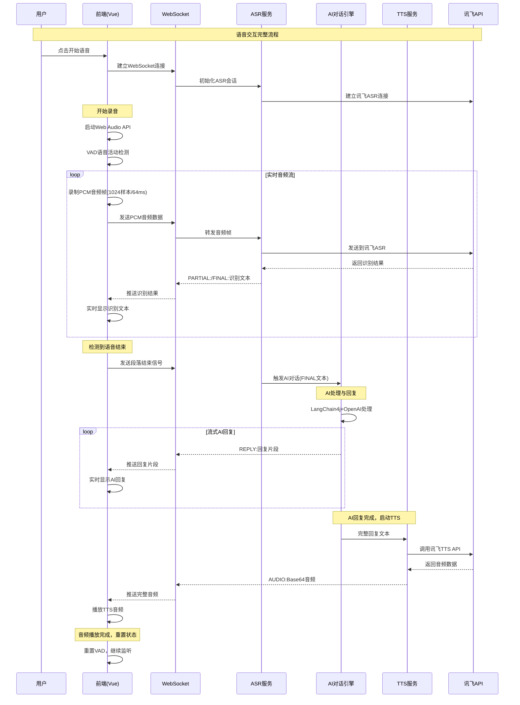

# AI Character Play 架构设计文档

## 项目概述

AI Character Play 是一个基于 Spring Boot + Vue 3 的智能对话应用，支持多角色AI对话、语音交互、实时聊天等功能。项目采用前后端分离架构，集成了多种AI服务和语音技术。

## 技术架构图

```
┌─────────────────────────────────────────────────────────────────────────────┐
│                           前端层 (Vue 3 + TypeScript)                        │
├─────────────────────────────────────────────────────────────────────────────┤
│  用户界面     │  语音交互     │  状态管理    │  路由管理    │  HTTP/WS通信    │
│  (Element+)   │  (Web Audio)  │  (Pinia)     │  (Router)    │  (Axios/WS)     │
│               │  VAD/实时显示  │              │              │                 │
└─────────────────────────────────────────────────────────────────────────────┘
                                        │
                    ┌───────────────────┼───────────────────┐
                    │                   │                   │
                    ▼                   ▼                   ▼
┌─────────────────────────┐  ┌─────────────────────────┐  ┌─────────────────────────┐
│      HTTP API层          │  │    WebSocket通信层       │  │      静态资源层          │
├─────────────────────────┤  ├─────────────────────────┤  ├─────────────────────────┤
│ REST接口 + CORS配置      │  │ 实时语音数据传输         │  │ 文件上传/下载           │
│ 用户/应用/历史管理       │  │ AudioWebSocketHandler   │  │ 应用封面/音频文件       │
│ SSE流式对话             │  │ 会话管理 + 握手验证      │  │                        │
└─────────────────────────┘  └─────────────────────────┘  └─────────────────────────┘
                    │                   │                   │
                    └───────────────────┼───────────────────┘
                                        ▼
┌─────────────────────────────────────────────────────────────────────────────┐
│                              业务逻辑层                                      │
├─────────────────────────────────────────────────────────────────────────────┤
│  用户管理     │  应用管理     │  AI对话引擎   │  语音处理     │  聊天历史      │
│  UserService  │  AppService   │  AiChatSvc   │  ASR/TTS Svc  │  HistoryService │
│  权限验证     │  CRUD+缓存    │  LangChain4j │  讯飞SDK集成  │  分页查询      │
└─────────────────────────────────────────────────────────────────────────────┘
                                        │
                    ┌───────────────────┼───────────────────┐
                    │                   │                   │
                    ▼                   ▼                   ▼
┌─────────────────────────┐  ┌─────────────────────────┐  ┌─────────────────────────┐
│      关系数据库          │  │       缓存层            │  │      向量存储           │
├─────────────────────────┤  ├─────────────────────────┤  ├─────────────────────────┤
│ MySQL 8.0               │  │ Redis                   │  │ InMemory EmbeddingStore │
│ MyBatis Plus ORM        │  │ 对话记忆存储            │  │ RAG知识库               │
│ 用户/应用/历史表         │  │ 精选应用缓存            │  │ 文档向量化检索          │
└─────────────────────────┘  └─────────────────────────┘  └─────────────────────────┘
                                        │
                                        ▼
┌─────────────────────────────────────────────────────────────────────────────┐
│                              外部服务层                                      │
├─────────────────────────────────────────────────────────────────────────────┤
│  阿里云通义千问    │  讯飞语音云      │  OpenAI Embedding  │  连接池管理       │
│  (AI对话生成)     │  (ASR/TTS)      │  (文档向量化)       │  (性能优化)       │
│  LangChain4j集成  │  WebSocket连接   │  RAG知识检索       │  XunfeiPool      │
└─────────────────────────────────────────────────────────────────────────────┘
```

## 语音交互核心流程架构

### 语音交互完整流程图


```mermaid
sequenceDiagram
    participant U as 用户
    participant F as 前端(Vue)
    participant W as WebSocket
    participant ASR as ASR服务
    participant AI as AI对话引擎
    participant TTS as TTS服务
    participant XF as 讯飞API

    Note over U,XF: 语音交互完整流程
    
    U->>F: 点击开始语音
    F->>W: 建立WebSocket连接
    W->>ASR: 初始化ASR会话
    ASR->>XF: 建立讯飞ASR连接
    
    Note over F: 开始录音
    F->>F: 启动Web Audio API
    F->>F: VAD语音活动检测
    
    loop 实时音频流
        F->>F: 录制PCM音频帧(1024样本/64ms)
        F->>W: 发送PCM音频数据
        W->>ASR: 转发音频帧
        ASR->>XF: 发送到讯飞ASR
        XF-->>ASR: 返回识别结果
        ASR-->>W: PARTIAL:/FINAL:识别文本
        W-->>F: 推送识别结果
        F->>F: 实时显示识别文本
    end
    
    Note over F: 检测到语音结束
    F->>W: 发送段落结束信号
    ASR->>AI: 触发AI对话(FINAL文本)
    
    Note over AI: AI处理与回复
    AI->>AI: LangChain4j+OpenAI处理
    
    loop 流式AI回复
        AI-->>W: REPLY:回复片段
        W-->>F: 推送回复片段
        F->>F: 实时显示AI回复
    end
    
    Note over AI,TTS: AI回复完成，启动TTS
    AI->>TTS: 完整回复文本
    TTS->>XF: 调用讯飞TTS API
    XF-->>TTS: 返回音频数据
    TTS-->>W: AUDIO:Base64音频
    W-->>F: 推送完整音频
    F->>F: 播放TTS音频
    
    Note over F: 音频播放完成，重置状态
    F->>F: 重置VAD，继续监听
```

### 技术实现细节

#### 前端音频处理 
- **Web Audio API**: 实时音频录制和播放
- **VAD算法**: 智能语音活动检测，自动断句
- **音频格式**: PCM 16kHz 单声道，1024样本/帧
- **实时显示**: 流式ASR结果和AI回复显示
- **状态管理**: 录音状态、连接状态、播放状态

#### WebSocket通信协议
- **音频数据**: 二进制PCM数据流
- **ASR结果**: `PARTIAL:`部分结果, `FINAL:`最终结果
- **AI回复**: `REPLY:`流式回复片段
- **TTS音频**: `AUDIO:`Base64编码音频数据
- **控制信号**: JSON格式控制消息

#### 后端语音处理
- **ASR服务**: 讯飞实时语音识别集成
- **TTS服务**: 讯飞语音合成集成
- **音频存储**: 可选的音频文件存储

## 模块架构设计

### 1. 前端架构 (Vue 3 + TypeScript)

#### 1.1 目录结构
```
aichat-vue/
├── src/
│   ├── components/          # 通用组件
│   │   ├── VoiceChatBox.vue # 语音聊天组件
│   │   ├── ChatMessage.vue  # 消息组件
│   │   └── AppCard.vue      # 应用卡片组件
│   ├── pages/               # 页面组件
│   │   ├── User/            # 用户相关页面
│   │   ├── App/             # 应用管理页面
│   │   ├── Chat/            # 聊天页面
│   │   └── TestLogin.vue    # 登录测试页面
│   ├── layouts/             # 布局组件
│   │   └── BasicLayout.vue  # 基础布局
│   ├── stores/              # 状态管理
│   │   ├── user.ts          # 用户状态
│   │   ├── app.ts           # 应用状态
│   │   └── chat.ts          # 聊天状态
│   ├── services/            # API服务
│   │   ├── api.ts           # API配置
│   │   ├── userService.ts   # 用户服务
│   │   ├── appService.ts    # 应用服务
│   │   └── chatService.ts   # 聊天服务
│   ├── router/              # 路由配置
│   │   ├── index.ts         # 路由定义
│   │   └── guard.ts         # 路由守卫
│   └── types/               # 类型定义
│       ├── user.ts          # 用户类型
│       ├── app.ts           # 应用类型
│       └── chat.ts          # 聊天类型
```

#### 1.2 核心模块

**语音交互模块 (ASR/TTS)**
- **功能**: 语音识别、语音合成、音频处理
- **技术栈**: Web Audio API + 讯飞语音SDK
- **核心文件**: 
  - `VoiceChatBox.vue` - 语音聊天界面
  - `voiceService.ts` - 语音服务封装

**用户界面模块**
- **功能**: 响应式UI设计、用户交互、组件封装
- **技术栈**: Vue 3 + Element Plus + TypeScript
- **核心文件**:
  - 各页面组件和通用组件
  - CSS样式和主题配置

**状态管理模块**

- **功能**: 全局状态管理、数据持久化
- **技术栈**: Pinia + localStorage
- **核心文件**: `stores/` 目录下的状态管理文件

### 2. 后端架构 (Spring Boot)

#### 2.1 目录结构
```
src/main/java/com/character/
├── controller/                    # 控制器层
│   ├── UserController.java        # 用户管理 (注册/登录/权限)
│   ├── AppController.java         # 应用管理 (CRUD/精选/开场白TTS)
│   ├── AiChatController.java      # AI对话 (流式对话/SSE)
│   └── ChatHistoryController.java # 聊天历史 (分页查询/导出)
├── service/                       # 业务逻辑层
│   ├── impl/                      # 服务实现
│   │   ├── UserServiceImpl.java       # 用户服务实现
│   │   ├── AppServiceImpl.java        # 应用服务实现 (含AI对话)
│   │   ├── ChatHistoryServiceImpl.java # 聊天历史服务实现
│   │   ├── ASRServiceImpl.java        # 语音识别服务实现
│   │   └── TTSServiceImpl.java        # 语音合成服务实现
│   ├── UserService.java           # 用户服务接口
│   ├── AppService.java            # 应用服务接口
│   ├── ChatHistoryService.java    # 聊天历史服务接口
│   ├── ASRService.java            # 语音识别服务接口
│   ├── TTSService.java            # 语音合成服务接口
│   └── XunfeiConnectionPool.java  # 讯飞连接池管理
├── websocket/                     # WebSocket处理
│   ├── AudioWebSocketHandler.java      # 音频WebSocket处理器
│   ├── WebSocketSessionManager.java    # 会话管理器
│   └── AudioHandshakeInterceptor.java  # 握手拦截器
├── webSocketHandler/              # 其他WebSocket处理器
│   └── ChatSocketHandler.java     # 聊天WebSocket处理器
├── ai/                           # AI服务层
│   ├── AiChatService.java         # AI聊天服务接口
│   └── AiChatServiceFactory.java  # AI服务工厂
├── model/                        # 数据模型
│   ├── entity/                   # 实体类
│   │   ├── User.java             # 用户实体
│   │   ├── App.java              # 应用实体
│   │   └── ChatHistory.java      # 聊天记录实体
│   ├── dto/                      # 数据传输对象
│   │   ├── user/                 # 用户相关DTO
│   │   ├── app/                  # 应用相关DTO
│   │   └── chatHistory/          # 聊天历史相关DTO
│   ├── vo/                       # 视图对象
│   │   ├── UserVO.java           # 用户视图对象
│   │   ├── AppVO.java            # 应用视图对象
│   │   └── ChatHistoryResponse.java # 聊天历史响应对象
│   └── enums/                    # 枚举类
│       ├── UserRoleEnum.java     # 用户角色枚举
│       └── ChatHistoryMessageTypeEnum.java # 消息类型枚举
├── mapper/                       # 数据访问层
│   ├── UserMapper.java           # 用户数据访问
│   ├── AppMapper.java            # 应用数据访问
│   └── ChatHistoryMapper.java    # 聊天记录数据访问
├── config/                       # 配置类
│   ├── AudioWebSocketConfig.java      # 音频WebSocket配置
│   ├── ChatWebSocketConfig.java       # 聊天WebSocket配置
│   ├── CorsConfig.java                # 跨域配置
│   ├── JsonConfig.java                # JSON序列化配置
│   ├── RAGConfig.java                 # RAG检索增强配置
│   ├── RedisChatMemoryStoreConfig.java # Redis聊天记忆配置
│   └── chatModel/                     # AI模型配置
│       ├── ChatModelConfig.java       # 聊天模型配置
│       └── RedisCacheManagerConfig.java # Redis缓存管理配置
├── annotation/                   # 注解定义
│   └── AuthCheck.java            # 权限检查注解
├── aop/                         # 切面编程
│   └── AuthInterceptor.java      # 权限拦截器
├── common/                      # 通用组件
│   ├── BaseResponse.java         # 统一响应格式
│   ├── ResultUtils.java          # 响应工具类
│   ├── PageRequest.java          # 分页请求
│   └── DeleteRequest.java        # 删除请求
├── exception/                   # 异常处理
│   ├── GlobalExceptionHandler.java # 全局异常处理器
│   ├── BusinessException.java      # 业务异常
│   ├── ErrorCode.java             # 错误码定义
│   └── ThrowUtils.java            # 异常抛出工具
├── constant/                    # 常量定义
│   ├── UserConstant.java         # 用户相关常量
│   └── AppConstant.java          # 应用相关常量
└── util/                        # 工具类
    ├── CacheKeyUtils.java        # 缓存键生成工具
    ├── TTSUtil.java              # TTS工具类
    └── SpringContextUtil.java    # Spring上下文工具
```

#### 2.2 核心模块

**语音处理模块 (ASR/TTS)**
- **功能**: 实时语音识别、语音合成、WebSocket音频传输
- **技术栈**: 讯飞语音云SDK + WebSocket + Reactive Streams
- **核心文件**:
  - `ASRServiceImpl.java` - 语音识别服务实现
  - `TTSServiceImpl.java` - 语音合成服务实现
  - `AudioWebSocketHandler.java` - 音频WebSocket处理器
  - `XunfeiConnectionPool.java` - 讯飞连接池管理

**用户管理模块**
- **功能**: 用户注册、登录、权限管理、Session管理
- **技术栈**: Spring Boot + Redis Session + AOP权限控制
- **核心文件**:
  - `UserController.java` - 用户接口控制器
  - `UserServiceImpl.java` - 用户业务逻辑实现
  - `AuthInterceptor.java` - 权限拦截器

**应用管理模块**
- **功能**: AI应用创建、配置、管理、精选应用缓存
- **技术栈**: MyBatis Plus + Redis缓存
- **核心文件**:
  - `AppController.java` - 应用接口控制器
  - `AppServiceImpl.java` - 应用业务逻辑实现

**AI对话模块**
- **功能**: 流式AI对话生成、上下文管理、角色扮演
- **技术栈**: LangChain4j + 阿里云通义千问 + Server-Sent Events
- **核心文件**:
  - `AiChatController.java` - AI对话接口控制器
  - `AiChatService.java` - AI聊天服务接口
  - `AppServiceImpl.chat()` - 对话业务逻辑

**聊天历史模块**
- **功能**: 聊天记录存储、游标分页查询、历史导出
- **技术栈**: MyBatis Plus + MySQL + 游标分页
- **核心文件**:
  - `ChatHistoryController.java` - 聊天历史接口控制器
  - `ChatHistoryServiceImpl.java` - 聊天历史服务实现

**RAG检索增强模块**
- **功能**: 文档向量化、知识检索、上下文增强
- **技术栈**: OpenAI Embedding + 内存向量库
- **核心文件**:
  - `RAGConfig.java` - RAG配置和向量库初始化

**WebSocket通信模块**
- **功能**: 实时音频传输、会话管理、连接池优化
- **技术栈**: Spring WebSocket + Reactive Streams
- **核心文件**:
  - `AudioWebSocketHandler.java` - 音频WebSocket处理器
  - `WebSocketSessionManager.java` - 会话管理器
  - `AudioHandshakeInterceptor.java` - 握手验证拦截器

### 3. 数据库设计

#### 3.1 核心表结构

**用户表 (user)**
```sql
CREATE TABLE `user` (
  `id` bigint NOT NULL AUTO_INCREMENT COMMENT 'id',
  `user_account` varchar(256) NOT NULL COMMENT '账号',
  `user_password` varchar(512) NOT NULL COMMENT '密码',
  `user_name` varchar(256) DEFAULT NULL COMMENT '用户昵称',
  `user_avatar` varchar(1024) DEFAULT NULL COMMENT '用户头像',
  `user_profile` varchar(512) DEFAULT NULL COMMENT '用户简介',
  `user_role` varchar(256) NOT NULL DEFAULT 'user' COMMENT '用户角色',
  `create_time` datetime NOT NULL DEFAULT CURRENT_TIMESTAMP,
  `update_time` datetime NOT NULL DEFAULT CURRENT_TIMESTAMP ON UPDATE CURRENT_TIMESTAMP,
  `is_delete` tinyint NOT NULL DEFAULT '0',
  PRIMARY KEY (`id`),
  UNIQUE KEY `uk_userAccount` (`user_account`)
);
```

**应用表 (app)**
```sql
CREATE TABLE `app` (
  `app_id` bigint NOT NULL AUTO_INCREMENT COMMENT '应用ID',
  `app_name` varchar(255) DEFAULT NULL COMMENT '应用名',
  `description` varchar(255) DEFAULT NULL COMMENT '应用介绍',
  `init_prompt` varchar(1000) DEFAULT NULL COMMENT '初始化提示',
  `cover` varchar(255) DEFAULT NULL COMMENT '封面图片URL',
  `user_id` bigint NOT NULL COMMENT '所属用户ID',
  `prologue` varchar(1000) DEFAULT NULL COMMENT '开场白',
  `priority` int DEFAULT NULL COMMENT '优先级',
  `create_time` datetime DEFAULT CURRENT_TIMESTAMP,
  `update_time` datetime DEFAULT NULL ON UPDATE CURRENT_TIMESTAMP,
  `is_delete` tinyint DEFAULT '0',
  PRIMARY KEY (`app_id`)
);
```

**聊天记录表 (chat_history)**
```sql
CREATE TABLE `chat_history` (
  `id` bigint NOT NULL AUTO_INCREMENT COMMENT 'id',
  `message` text NOT NULL COMMENT '消息',
  `message_type` varchar(32) NOT NULL COMMENT 'user/ai',
  `app_id` bigint NOT NULL COMMENT '应用id',
  `user_id` bigint NOT NULL COMMENT '创建用户id',
  `create_time` datetime NOT NULL DEFAULT CURRENT_TIMESTAMP,
  `update_time` datetime NOT NULL DEFAULT CURRENT_TIMESTAMP ON UPDATE CURRENT_TIMESTAMP,
  `is_delete` tinyint NOT NULL DEFAULT '0',
  PRIMARY KEY (`id`),
  KEY `idx_appId_createTime` (`app_id`,`create_time`)
);
```

### 4. API接口设计

#### 4.1 用户管理接口
```
POST /api/user/register     # 用户注册
POST /api/user/login        # 用户登录
POST /api/user/logout       # 用户登出
GET  /api/user/current      # 获取当前用户信息
PUT  /api/user/update       # 更新用户信息
```

#### 4.2 应用管理接口
```
GET    /api/app/list        # 获取应用列表
POST   /api/app/create      # 创建应用
PUT    /api/app/update      # 更新应用
DELETE /api/app/delete      # 删除应用
GET    /api/app/{id}        # 获取应用详情
```

#### 4.3 对话接口
```
POST /api/chat/send         # 发送消息
GET  /api/chat/history      # 获取聊天历史
WS   /api/chat/stream       # WebSocket流式对话
```

#### 4.4 语音接口
```
POST /api/voice/asr         # 语音识别
POST /api/voice/tts         # 语音合成
POST /api/voice/upload      # 音频文件上传
```

## 开发分工

### 张子涵 (前端界面 + 后端核心语音处理)

#### 前端界面开发
- **Vue 3 组件开发**: 负责所有页面组件和通用组件的开发
- **响应式UI设计**: 使用Element Plus实现现代化界面
- **用户体验优化**: 实时音量条、状态指示器、声波动画
- **状态管理**: Pinia状态管理和数据持久化
- **路由管理**: Vue Router配置和路由守卫
- **音频采集与处理**：实时音量监测 + 动态阈值调整（VAD静音检测），Web Audio API 获取麦克风流
- **WebSocket 实时通信**：音频上传 + 识别结果/合成音频下发，消息分类（PARTIAL、FINAL、REPLY、AUDIO）

#### 后端语音处理 (ASR/TTS) 核心技术

##### 1. 讯飞语音服务集成
**核心功能**: 集成讯飞语音云API，提供语音识别和合成服务
- **API接口封装**: 封装讯飞ASR和TTS的HTTP API调用，处理认证和参数配置
- **会话管理**: 为每个用户语音交互创建独立的会话实例，维护会话状态
- **错误处理**: 实现API调用失败的重试机制和异常处理逻辑
- **配置管理**: 统一管理讯飞应用ID、密钥等配置信息

##### 2. ASR (语音识别) 服务实现
**核心功能**: 将用户语音转换为文本，支持实时识别
- **音频流处理**: 接收前端WebSocket传输的PCM音频数据流
- **实时识别**: 调用讯飞实时语音识别API，获取识别结果
- **结果分类处理**: 区分处理部分识别结果（PARTIAL）和最终结果（FINAL）
- **识别结果推送**: 通过WebSocket将识别结果实时推送给前端

##### 3. TTS (语音合成) 服务实现
**核心功能**: 将AI回复文本转换为语音音频
- **文本预处理**: 对AI生成的文本进行格式化和特殊字符处理
- **语音合成**: 调用讯飞TTS API生成音频数据
- **音频编码**: 将生成的音频数据进行Base64编码，便于网络传输
- **开场白TTS**: 专门处理应用开场白的语音合成和播放

##### 4. WebSocket服务端架构
**核心功能**: 提供实时双向通信支持
- **连接管理**: 管理WebSocket连接的建立、维持和关闭
- **消息分发**: 根据消息类型路由到相应的处理服务（ASR/TTS/AI对话）
- **状态同步**: 维护前后端的连接状态和录音状态同步
- **异常处理**: 处理网络中断、超时等异常情况

##### 5. 音频数据处理
**核心功能**: 处理音频数据的格式转换和传输
- **格式支持**: 支持PCM、WAV等音频格式的处理
- **数据转换**: 实现前端音频数据到讯飞API要求格式的转换
- **Base64编码**: 对TTS生成的音频进行Base64编码处理
- **流式传输**: 支持音频数据的流式接收和发送

##### 6. 语音交互流程控制
**核心功能**: 协调整个语音交互的完整流程
- **录音状态管理**: 控制录音的开始、停止和状态切换
- **识别触发**: 根据语音结束信号触发ASR识别和AI对话
- **回复流程**: 协调AI回复生成和TTS语音合成的完整流程
- **状态通知**: 向前端推送各个阶段的状态变化信息

#### 核心交付物
1. **前端完整界面** - 所有页面和组件，包括响应式设计和用户体验优化
2. **语音交互系统** - 完整的ASR/TTS流程，包括VAD、实时识别、音频播放等核心功能
3. **WebSocket通信协议** - 前后端实时通信的完整协议实现和状态管理
4. **音频处理引擎** - 基于Web Audio API的高质量音频录制和播放系统
5. **语音服务集成** - 讯飞语音云服务的完整集成和优化
6. **用户体验优化** - 流畅的交互体验，包括状态可视化、错误处理、性能优化
7. **技术文档** - 前端和语音模块的详细技术文档和使用说明

### 李学武 (后端核心业务 + AI集成)

#### 数据库设计模块
- **表结构设计**: 
  - 用户表 (user) - 用户基础信息和权限管理
  - 应用表 (app) - AI应用配置和元数据
  - 聊天记录表 (chat_history) - 对话历史存储

#### NLP对话引擎模块
- **AI模型集成**: 
  - LangChain4j框架集成和配置
  -  阿里云通义千问接口封装
- **对话管理**: 
  - 上下文管理和会话状态维护
  - 对话轮次控制和历史上下文
  - 流式对话和实时响应处理
- **角色扮演**: 
  - 多角色AI配置系统 (哈利波特、马保国、苏格拉底等)
  - 角色提示词模板管理
  - 角色切换和状态保持

#### 对话历史管理模块
- **历史记录存储**: 
  - 聊天记录的结构化存储设计
  - 消息类型分类 (user/ai) 和元数据
  - 大量历史数据的存储优化
- **检索优化**: 
  - 基于应用ID和时间的快速检索
  - 分页查询和游标分页实现
  - 全文搜索和关键词检索

#### RAG功能模块 (检索增强生成)
- **知识库构建**: 
  - 文档向量化和索引构建
- **文档处理**: 
  - 文本分块与切分
- **上下文增强**: 
  - 检索结果与对话上下文融合
  - 动态知识注入和引用
  - 元数据过滤与生成结果相关性提升

#### 用户管理模块
- **用户认证**: 
  - 用户注册和登录逻辑
  - 密码加密和安全验证
  - 多端登录状态同步
- **权限管理**: 
  - 用户权限验证和授权
  - 管理员功能和用户管理
- **会话管理**: 
  - Redis Session存储和持久化

#### 应用管理模块
- **应用配置**: 
  - AI应用创建和配置管理
  - 应用元数据和参数设置
- **应用市场**: 
  - 应用列表展示和搜索

#### 核心交付物
1. **完整后端API系统** - 所有业务接口和数据处理
2. **AI对话引擎** - 智能对话生成和管理
3. **数据库架构** - 完整的数据存储和管理方案
4. **RAG知识系统** - 检索增强生成功能
5. **系统安全和性能** - 认证、缓存、监控体系
6. **技术文档** - 后端架构和AI模块技术文档

## 技术选型说明

### 前端技术栈
- **Vue 3**: 现代化前端框架，支持Composition API
- **TypeScript**: 类型安全，提高代码质量
- **Element Plus**: 成熟的UI组件库
- **Pinia**: 轻量级状态管理
- **Vite**: 快速构建工具
- **Axios**: HTTP客户端

### 后端技术栈
- **Spring Boot 3**: 企业级Java框架
- **MyBatis Plus**: 高效的ORM框架
- **MySQL 8.0**: 关系型数据库
- **Redis**: 缓存和Session存储
- **LangChain4j**: Java版LangChain，AI集成
- **讯飞语音**: 语音识别和合成服务

### AI服务
- **OpenAI API**: GPT模型对话生成
- **阿里云通义千问**: 备选AI服务
- **讯飞语音**: ASR和TTS服务
- **向量数据库**: RAG功能支持

---

**文档版本**: v1.0  
**创建时间**: 2025-09-27  
**项目负责人**: 

- **张子涵**: 前端界面设计开发 + 后端业务 + 语音处理 (ASR/TTS) 
- **李学武**: 后端业务 + AI集成 + 数据库设计
- **更新记录**: 初始版本创建，详细分工说明